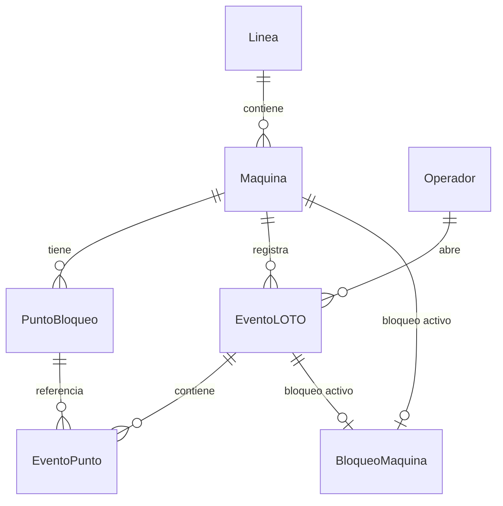
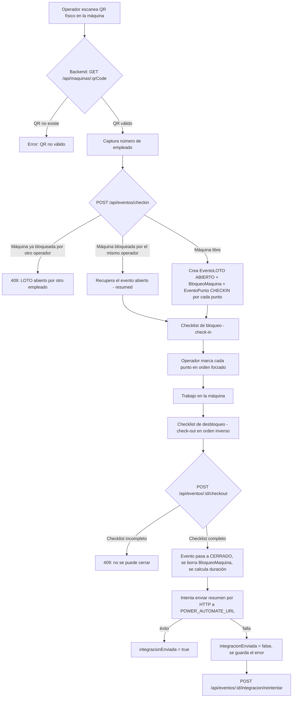

# LOTO Digital — Documentación Técnica

## Deploy en Railway

Este repositorio despliega frontend y backend como un solo servicio. Railway debe usar la raíz del repositorio y leer [railway.json](railway.json).

Variables requeridas en Railway:

```env
DATABASE_URL=file:./loto.db
POWER_AUTOMATE_URL=
```

Si `DATABASE_URL` no está definida, el build y el servidor usan automáticamente `file:./loto.db`. Para conservar SQLite entre redeploys, configura un volumen y define `DATABASE_URL` apuntando a la ruta persistente.

El `buildCommand` compila el frontend y sincroniza SQLite. El servidor arranca con `node src/server.js` y escucha el puerto que Railway entrega mediante `PORT`. El healthcheck es:

```text
/health
```

No uses `npm run dev`, `vite` ni `node dev start` como Start Command en Railway.

Sistema de digitalización del proceso de bloqueo y etiquetado (LOTO — *Lockout/Tagout*) para máquinas industriales. Permite a un operador escanear el código QR de una máquina, seguir un checklist de bloqueo forzado por orden (check‑in), realizar el trabajo, y luego seguir el checklist de desbloqueo en orden inverso (check‑out), quedando el evento registrado y enviado por webhook a un dashboard externo.

---

## 1. Resumen del proyecto

| | |
|---|---|
| **Objetivo** | Reemplazar el proceso manual de bloqueo/etiquetado por un checklist digital vía QR, con registro trazable de cada bloqueo y desbloqueo. |
| **Alcance cubierto** | Checkpoint (escaneo de QR) → Check‑in (checklist de bloqueo) → Check‑out (checklist de desbloqueo inverso) → Registro del evento → Envío HTTP al dashboard. |
| **Fuera de alcance** | El dashboard en sí (Power BI / Power Automate), que lo gestiona otra persona. |
| **Stack** | Backend: Node.js + Express 5 + Prisma ORM + SQLite. Frontend: React 19 + Vite, PWA con `html5-qrcode` para lectura de cámara. |
| **Identificación del operador** | Solo número de empleado (sin PIN ni badge). Máquina y línea se resuelven automáticamente desde el QR. |
| **Checklist** | Solo con checkbox (sin evidencia fotográfica), específico por máquina, con avance forzado en orden. |

---

## 2. Arquitectura general

```
┌─────────────────┐        HTTP/JSON        ┌──────────────────────┐        HTTP POST        ┌───────────────┐
│  Frontend (PWA)  │  ───────────────────▶   │   Backend (Express)  │  ───────────────────▶   │   Dashboard    │
│  React + Vite     │  ◀───────────────────   │   Prisma + SQLite     │   (evento cerrado)       │ (Power Automate│
│  html5-qrcode      │                        │                        │                          │  / Power BI)   │
└─────────────────┘                        └──────────────────────┘                          └───────────────┘
        │
        │ Cámara del celular/tablet
        ▼
   QR físico pegado
     en la máquina
```

- El **frontend** es una PWA (con service worker y manifest) pensada para usarse desde el celular o tablet del operador, con cámara para leer el QR.
- El **backend** expone una API REST bajo `/api`, usa Prisma como ORM sobre una base de datos **SQLite** (archivo local `loto.db`).
- Al cerrar un evento (check‑out completo), el backend intenta enviar el resumen del evento por HTTP a una URL de webhook (`POWER_AUTOMATE_URL`), que alimenta el dashboard externo. Si falla, el evento queda marcado como pendiente de integración y puede reintentarse.

### 2.1 Estructura de carpetas

```
LOTOdigital-main/
├── package.json                  # workspace raíz (frontend + backend)
├── backend/
│   ├── package.json
│   ├── .env.example               # DATABASE_URL, PORT, POWER_AUTOMATE_URL
│   ├── prisma/
│   │   ├── schema.prisma          # modelo de datos
│   │   └── seed.js                # datos de ejemplo (Línea 3 / Prensa 12)
│   └── src/
│       ├── app.js                 # rutas y lógica de negocio (Express)
│       ├── server.js              # arranque del servidor
│       └── lib/prisma.js          # cliente Prisma singleton
└── frontend/
    ├── package.json
    ├── .env.example               # VITE_API_URL
    ├── index.html
    ├── vite.config.js
    ├── public/
    │   ├── manifest.webmanifest   # PWA
    │   ├── sw.js                  # service worker (cache del app shell)
    │   └── icon.svg
    └── src/
        ├── main.jsx                # entrada, registra el service worker
        ├── App.jsx                 # toda la UI y lógica del cliente
        └── styles.css
```

---

## 3. Modelo de datos (Prisma / SQLite)



### 3.1 Entidades

**Linea** — línea de producción. `nombre` único (ej. "Línea 3").

**Maquina** — máquina física. `qrCode` único (identifica el QR pegado en la máquina), pertenece a una `Linea`, tiene varios `PuntoBloqueo` (su checklist específico) y su historial de `EventoLOTO`.

**PuntoBloqueo** — un punto de bloqueo específico de una máquina (ej. "Cerrar válvula neumática"). Tiene `tipoEnergia` (`ELECTRICA`, `NEUMATICA`, `HIDRAULICA`, `GRAVEDAD`, `MECANICA`, `OTRA`) y un `orden` dentro de esa máquina. La combinación `(maquinaId, orden)` es única, lo que define la secuencia forzada del checklist.

**Operador** — identificado únicamente por `numeroEmpleado` (se crea automáticamente en su primer check‑in si no existe).

**EventoLOTO** — un ciclo completo de bloqueo/desbloqueo sobre una máquina, hecho por un operador. Tiene estado `ABIERTO`/`CERRADO`, hora de inicio/fin, duración calculada, y banderas de integración (`integracionEnviada`, `integracionError`) para saber si el webhook al dashboard tuvo éxito.

**BloqueoMaquina** — marca que una máquina tiene actualmente un bloqueo activo (relación 1 a 1 única por `maquinaId` y por `eventoId`). Es lo que impide que dos operadores abran un LOTO sobre la misma máquina al mismo tiempo. Se borra al hacer check‑out.

**EventoPunto** — el estado (completado o no, y cuándo) de cada `PuntoBloqueo` dentro de un `EventoLOTO`, diferenciando si es paso de `CHECKIN` o de `CHECKOUT`. La combinación `(eventoId, puntoBloqueoId, tipo)` es única.

### 3.2 Enums

- `EstadoEvento`: `ABIERTO`, `CERRADO`
- `TipoEventoPunto`: `CHECKIN`, `CHECKOUT`
- `TipoEnergia`: `ELECTRICA`, `NEUMATICA`, `HIDRAULICA`, `GRAVEDAD`, `MECANICA`, `OTRA`

---

## 4. Flujo funcional completo



Puntos de negocio clave implementados en el backend:

- **Un QR por máquina**, no por punto de bloqueo individual — el checklist de esa máquina se resuelve completo al escanear.
- **Orden forzado**: no se puede completar el punto *N* del checklist si el punto *N‑1* no está completo, tanto en check‑in (orden normal) como en check‑out (orden inverso).
- **Exclusión mutua por máquina**: si una máquina ya tiene un evento `ABIERTO` (existe su `BloqueoMaquina`), otro operador no puede abrir un nuevo check‑in sobre ella hasta que se cierre; recibe un `409` con el número de empleado que la tiene bloqueada.
- **Reanudación de sesión**: si el mismo operador que abrió el bloqueo vuelve a escanear/hacer check‑in en esa máquina, el backend le regresa el evento abierto existente (`resumed: true`) en vez de crear uno nuevo — esto es lo que permite continuar el checklist si se cerró la app o se cambió de dispositivo.
- **Cierre solo si ambos checklists están completos**: el check‑out exige que el checklist de check‑in esté 100% completo *y* que todos los puntos de check‑out (retiro de bloqueos, en orden inverso) también lo estén.
- **Integración desacoplada del cierre**: el evento se cierra aunque el envío al dashboard falle; el error queda guardado y hay un endpoint dedicado para reintentar el envío sin reabrir el evento.

---

## 5. Backend — API REST

Prefijo base: `/api` (más un endpoint de salud fuera del prefijo). URL configurada en el frontend vía `VITE_API_URL` (por defecto `http://localhost:4000/api`).

### 5.1 Endpoints generales

| Método | Ruta | Descripción |
|---|---|---|
| GET | `/health` | Verifica que la API está viva. |
| GET | `/api/lineas` | Lista todas las líneas con sus máquinas. |

### 5.2 Catálogo de máquinas

**`POST /api/catalogo/maquinas`** — Da de alta (o actualiza, vía *upsert*) una máquina y su checklist de puntos de bloqueo.

- Body: `{ nombre, linea, qrCode, puntos: [{ nombre, tipoEnergia }] }`
- Si no se envían `puntos`, se crea un único punto genérico "Bloqueo general" (tipo `OTRA`).
- Crea la `Linea` si no existe (upsert por nombre).
- El `orden` de cada punto se asigna según su posición en el arreglo recibido.
- `qrCode` es único: si ya existe, se actualiza la máquina y sus puntos en vez de duplicar.
- Respuestas: `201` con la máquina creada/actualizada; `409` si hay conflicto de unicidad no controlado; `400` si faltan `nombre`, `linea` o `qrCode`.

**`GET /api/maquinas/:qrCode`** — Resuelve una máquina a partir del texto/código leído del QR, incluyendo su línea y su checklist de puntos (ordenado). `404` si el QR no corresponde a ninguna máquina registrada.

### 5.3 Ciclo de vida del evento LOTO

**`GET /api/eventos/activos`** — Lista todos los eventos con estado `ABIERTO` (para monitoreo/administración).

**`POST /api/eventos/reanudar`** — Dado un `numeroEmpleado`, devuelve todos los eventos abiertos que le pertenecen (con máquina, línea y puntos incluidos), para que el operador pueda continuar un checklist desde otro dispositivo o después de cerrar la app.

**`POST /api/eventos/checkin`** — Abre un LOTO.
- Body: `{ qrCode, numeroEmpleado }`.
- Crea el `Operador` si es su primer check‑in.
- Si la máquina ya tiene un evento abierto de **otro** operador → `409` con el número de empleado que la tiene bloqueada.
- Si la máquina ya tiene un evento abierto del **mismo** operador → lo devuelve tal cual (`resumed: true`), sin duplicar.
- Si la máquina está libre → crea el `EventoLOTO` (estado `ABIERTO`) junto con un `EventoPunto` tipo `CHECKIN` (pendiente) por cada punto de bloqueo de la máquina, y crea el `BloqueoMaquina` que la marca como ocupada. Todo dentro de una transacción Prisma.

**`POST /api/eventos/:id/checkpoint`** — Marca (o desmarca) un punto del checklist, de check‑in o de check‑out.
- Body: `{ puntoBloqueoId, tipo: 'CHECKIN' | 'CHECKOUT', completado }`.
- Valida que el punto pertenezca a la máquina del evento.
- Si se está completando (`completado: true`), valida que el punto **anterior en la secuencia correspondiente** (orden normal para check‑in, orden inverso para check‑out) ya esté completado; si no, responde `409`.
- Guarda (upsert) el registro `EventoPunto` con `completado` y `realizadoAt`.

**`POST /api/eventos/:id/checkout`** — Cierra el evento.
- Verifica que **todo** el checklist de check‑in esté completo.
- Verifica que **todo** el checklist de check‑out (orden inverso) esté completo.
- Si falta algo, responde `409` sin cerrar nada.
- Si todo está completo: calcula `duracionMinutos`, marca el evento como `CERRADO` con `horaFin`, y borra el `BloqueoMaquina` (libera la máquina) dentro de una transacción.
- Después intenta enviar el evento cerrado al webhook del dashboard (`sendClosedEvent`) y guarda si tuvo éxito (`integracionEnviada`) o el error (`integracionError`).
- Devuelve el evento cerrado y un `resumen` con los datos clave (máquina, línea, empleado, horas, duración, si se integró).

**`POST /api/eventos/:id/integracion/reintentar`** — Reintenta el envío al dashboard para un evento ya `CERRADO` cuya integración falló. No reintenta si ya se había enviado con éxito (`integracionEnviada: true`).

### 5.4 Integración con el dashboard (webhook)

Función `sendClosedEvent(evento, puntos)` en `app.js`:

- Solo se ejecuta si existe la variable de entorno `POWER_AUTOMATE_URL`; si no está configurada, simplemente no envía nada (`sent: false, error: null`) sin bloquear el cierre del evento.
- Hace un `POST` con `Content-Type: application/json` al webhook, con este payload:

```json
{
  "eventoId": "12",
  "maquina": "Prensa 12",
  "linea": "Línea 3",
  "numeroEmpleado": "48213",
  "checkin": "2026-09-15T14:02:00.000Z",
  "checkout": "2026-09-15T14:45:00.000Z",
  "duracionMinutos": 43,
  "puntos": [
    {
      "nombre": "Bloquear breaker principal",
      "tipoEnergia": "ELECTRICA",
      "orden": 1,
      "tipo": "CHECKIN",
      "realizadoAt": "2026-09-15T14:03:10.000Z"
    }
  ]
}
```

- Errores de red o respuestas HTTP no exitosas se capturan y se guardan en `integracionError` sin lanzar excepción — el cierre del evento nunca se pierde por un fallo del dashboard.

### 5.5 Manejo de errores

Middleware final de Express (`app.use((err, req, res, next) => ...)`) captura cualquier excepción no manejada en las rutas y responde `500` con `{ error: 'Error interno del servidor' }`, registrando el error en consola.

---

## 6. Frontend — PWA en React

Todo el cliente vive en `App.jsx` (un solo componente con estado local vía hooks, sin librería de manejo de estado ni router).

### 6.1 Pantallas / modos

La UI tiene dos modos controlados por pestañas (`mode`): **Check‑in** y **Check‑out**.

**Modo Check‑in:**
1. Sección plegable "Registrar máquina nueva" — formulario para dar de alta una máquina y su checklist (llama a `POST /api/catalogo/maquinas`). Pensado para uso de mantenimiento/administración, no del operador de línea.
2. Campo de texto para el QR (se llena solo al escanear, pero también se puede escribir manualmente).
3. Botón para abrir la cámara y escanear (usa `html5-qrcode`, cámara trasera `environment`).
4. Botón "Resolver QR" para consultar la máquina manualmente sin cámara.
5. Una vez resuelta la máquina, se muestra su nombre y línea.
6. Campo de número de empleado.
7. Botón "Abrir evento LOTO" → llama a `checkin`.
8. Si el evento se abre, aparece el **checklist de bloqueo**: lista de checkboxes en orden, cada uno deshabilitado hasta que el anterior esté marcado.

**Modo Check‑out:**
1. Sección "Continuar sesión guardada": el operador captura su número de empleado y el sistema busca (`POST /api/eventos/reanudar`) sus eventos abiertos, mostrando una lista para elegir cuál continuar. Esto cubre el caso de que el operador cierre la app entre el check‑in y el check‑out.
2. Al elegir un evento o al llegar desde el checklist de check‑in, se muestra el **checklist de desbloqueo**, en orden inverso al de bloqueo, también con avance forzado.
3. El botón "Cerrar LOTO" solo se habilita cuando **todos** los puntos de check‑out están completos, y llama a `POST /api/eventos/:id/checkout`.

### 6.2 Lectura de QR

- `extractQrCode(value)`: si el texto leído es una URL válida, extrae el parámetro `?qr=`; si no, usa el texto tal cual. Esto permite que el QR físico codifique tanto un código plano como una URL con el código como parámetro.
- El escáner (`Html5Qrcode`) se monta/desmonta según el estado `scannerOpen`, apuntando a un `<div id="qr-reader">`. Al detectar un código, resuelve la máquina contra el backend automáticamente y cierra la cámara.
- Si la cámara no está disponible o se niegan permisos, se muestra un error legible al operador.

### 6.3 Manejo de estado y errores

- Un solo estado `error` (string) se usa para mostrar cualquier problema (QR inválido, máquina ya bloqueada, fallo de red, checklist fuera de orden, etc.) al pie del formulario.
- Cada acción que llama al backend maneja tanto respuestas no exitosas (`res.ok === false`, mostrando el mensaje del backend) como errores de conexión (try/catch).
- El caso `409` de "máquina ya bloqueada por otro operador" muestra explícitamente el número de empleado que la tiene ocupada.

### 6.4 PWA (uso desde celular/tablet)

- `manifest.webmanifest`: nombre "LOTO Digital", modo `standalone` (se abre como app, sin barra del navegador), ícono propio.
- `sw.js` (service worker): cachea el *app shell* (`/`, `/index.html`, manifest, ícono) para que la app cargue offline; explícitamente **no** cachea ni intercepta llamadas a `/api/`, así que los datos siempre son en vivo cuando hay conexión.
- `main.jsx` registra el service worker al cargar la página.

---

## 7. Configuración y variables de entorno

**Backend (`backend/.env`, basado en `.env.example`):**

| Variable | Descripción |
|---|---|
| `DATABASE_URL` | Ruta del archivo SQLite, ej. `file:./loto.db` |
| `PORT` | Puerto del servidor Express (por defecto 4000) |
| `POWER_AUTOMATE_URL` | URL del webhook del dashboard. Si se deja vacía, el sistema funciona pero no envía nada al dashboard (queda como pendiente de integración). |

**Frontend (`frontend/.env`, basado en `.env.example`):**

| Variable | Descripción |
|---|---|
| `VITE_API_URL` | URL base de la API del backend, ej. `http://localhost:4000/api` |

---

## 8. Puesta en marcha (desarrollo)

Desde la raíz del repo (usa *npm workspaces*, definidos en el `package.json` raíz):

```bash
npm install                     # instala dependencias de frontend y backend

# Backend: generar cliente Prisma y crear la base de datos
npm --workspace backend run prisma:generate
npm --workspace backend run db:push
npm --workspace backend run db:seed     # opcional: carga "Línea 3 / Prensa 12" de ejemplo

# Levantar ambos servicios a la vez (concurrently)
npm run dev
```

Esto corre en paralelo `vite` (frontend, puerto 5173) y `nodemon src/server.js` (backend, puerto 4000, o el que se configure en `PORT`).

Otros comandos útiles del backend: `npm --workspace backend run db:studio` (abre Prisma Studio para inspeccionar/editar datos directamente).

Para producción: `npm run build` genera el build estático del frontend (Vite); `npm start` levanta el backend con `node src/server.js` (sin recarga automática).

---

## 9. Puntos de atención / riesgos conocidos

- **SQLite y concurrencia de escritura**: SQLite bloquea la base completa durante cada escritura. Con pocos operadores simultáneos (uso típico de una sola línea/turno) no debería ser un problema, pero si el número de checkpoints simultáneos crece (varias líneas, muchas máquinas a la vez), conviene monitorear tiempos de respuesta o migrar a PostgreSQL/MySQL en el futuro — el modelo Prisma ya es compatible con ese cambio con ajustes mínimos.
- **Sin autenticación de operador**: solo se valida el número de empleado como texto libre, sin PIN ni credencial. Es una decisión de diseño intencional para agilizar el flujo en piso, pero implica que cualquiera que conozca o adivine un número de empleado podría abrir/cerrar un LOTO a su nombre.
- **Checklist sin evidencia fotográfica**: el cumplimiento de cada punto depende de que el operador marque honestamente el checkbox; no hay verificación física adicional (foto, sensor, etc.).
- **Dependencia del webhook**: si `POWER_AUTOMATE_URL` cambia de formato de payload, hay que actualizar `sendClosedEvent` en `app.js` para mantener la compatibilidad con el dashboard.
- **Un solo `error` global en el frontend**: es simple y suficiente para el flujo actual, pero si se agregan más pantallas simultáneas convendría separar el manejo de errores por sección.

---

## 10. Resumen de decisiones de diseño ya tomadas

- QR **por máquina**, no por punto de bloqueo.
- Checklist de check‑out = mismos puntos del check‑in, en **orden inverso**, con avance forzado en ambos sentidos.
- Identificación del operador **solo por número de empleado** (sin PIN/badge); máquina y línea se resuelven automáticamente desde el QR.
- Checklist **solo de checkbox**, sin evidencia fotográfica obligatoria.
- Persistencia en **SQLite** por simplicidad, con el trade‑off de concurrencia ya documentado.
- El **dashboard** (Power Automate + Excel + Power BI) es responsabilidad de otra persona; este sistema solo entrega el evento cerrado vía HTTP.
