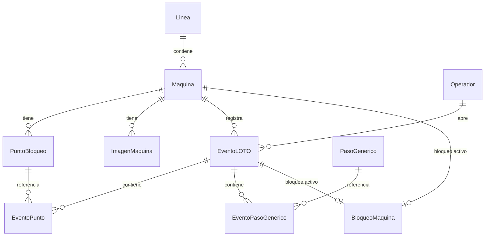
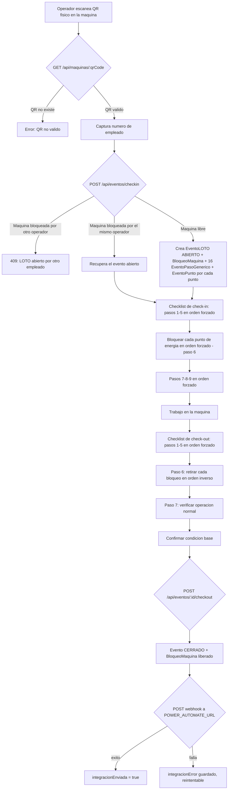

[README.md](https://github.com/user-attachments/files/32531395/README.md)
# LOTO Digital — Documentación Técnica

Sistema de digitalización del proceso de bloqueo y etiquetado (**LOTO** — *Lockout/Tagout*) para máquinas industriales. Permite a un operador escanear el código QR físico de una máquina, seguir un checklist de bloqueo (check‑in) con pasos generales más los puntos de bloqueo específicos de esa máquina, realizar el trabajo, y luego seguir un checklist de regreso a servicio (check‑out) hasta confirmar la condición base, quedando el evento registrado y enviado por webhook a un dashboard externo. Incluye además un panel de administración para dar de alta máquinas y sus checklists, monitorear eventos abiertos y consultar el historial.

---

## 1. Resumen del proyecto

| | |
|---|---|
| **Objetivo** | Reemplazar el proceso manual de bloqueo/etiquetado por un checklist digital vía QR, con registro trazable de cada bloqueo y desbloqueo. |
| **Alcance cubierto** | Checkpoint (escaneo de QR) → Check‑in (checklist general + puntos de bloqueo específicos de la máquina) → Trabajo → Check‑out (checklist de regreso a servicio + retiro de bloqueos + confirmación de condición base) → Registro del evento → Envío HTTP al dashboard. |
| **Fuera de alcance** | El dashboard en sí (Power BI / Power Automate), que lo gestiona otra persona. |
| **Stack** | Backend: Node.js + Express 5 + Prisma ORM + SQLite. Frontend: React 19 + Vite, PWA con `html5-qrcode` para lectura de cámara. |
| **Identificación del operador** | Solo número de empleado (sin PIN ni badge). Máquina y línea se resuelven automáticamente desde el QR. |
| **Checklist** | Checkbox con avance forzado en orden. El check‑in combina 8 pasos generales (procedimiento LOTO) con los puntos de bloqueo propios de cada máquina; el check‑out usa 7 pasos fijos de regreso a servicio más el retiro de esos mismos puntos y una confirmación final de condición base. |
| **Administración** | Módulo protegido por contraseña para registrar/editar/eliminar máquinas y sus checklists, ver eventos LOTO activos (con cierre administrativo) y consultar el historial. |

---

## 2. Arquitectura general

```
┌───────────────────┐        HTTP/JSON         ┌───────────────────────┐        HTTP POST         ┌────────────────┐
│  Frontend (PWA)     │  ────────────────────▶   │   Backend (Express)     │  ────────────────────▶   │   Dashboard      │
│  React + Vite        │  ◀────────────────────   │   Prisma + SQLite        │   (evento cerrado)         │ (Power Automate  │
│  html5-qrcode          │                        │                          │                            │  / Power BI)     │
└───────────────────┘                        └───────────────────────┘                          └────────────────┘
        │
        │ Cámara del celular/tablet
        ▼
   QR físico pegado
     en la máquina
```

- El **frontend** es una PWA (con service worker y manifest) pensada para usarse desde el celular o tablet del operador, con cámara para leer el QR. También aloja el panel de administración (catálogo de máquinas, monitor de eventos, historial).
- El **backend** expone una API REST bajo `/api`, usa Prisma como ORM sobre una base de datos **SQLite** (archivo local `loto.db`), y sirve el build estático del frontend en producción.
- Al cerrar un evento (check‑out completo), el backend intenta enviar el resumen del evento por HTTP a una URL de webhook (`POWER_AUTOMATE_URL`), que alimenta el dashboard externo. Si falla, el evento queda marcado como pendiente de integración y puede reintentarse.

### 2.1 Estructura de carpetas

```
LOTOdigital-main/
├── package.json                   # workspace raíz (frontend + backend)
├── railway.json                   # configuración de build/deploy en Railway
├── backend/
│   ├── package.json
│   ├── .env.example                # DATABASE_URL, PORT, POWER_AUTOMATE_URL
│   ├── prisma/
│   │   ├── schema.prisma           # modelo de datos
│   │   ├── seed.js                 # datos de ejemplo (Línea 3 / Prensa 12)
│   │   └── seed-pasos-genericos.js # siembra/actualiza los 8 pasos genéricos del procedimiento
│   └── src/
│       ├── app.js                  # rutas y lógica de negocio (Express)
│       ├── server.js               # arranque del servidor
│       └── lib/prisma.js           # cliente Prisma singleton
└── frontend/
    ├── package.json
    ├── .env.example                 # VITE_API_URL
    ├── index.html
    ├── vite.config.js
    ├── public/
    │   ├── manifest.webmanifest    # PWA
    │   ├── sw.js                   # service worker (cache del app shell)
    │   └── icon.svg
    └── src/
        ├── main.jsx                 # entrada, registra el service worker
        ├── App.jsx                  # toda la UI y lógica del cliente (un solo componente)
        └── styles.css
```

---

## 3. Modelo de datos (Prisma / SQLite)



### 3.1 Entidades

- **Linea** — línea de producción. `nombre` único (ej. "Línea 3").
- **Maquina** — máquina física. `qrCode` único (identifica el QR pegado en la máquina), pertenece a una `Linea`, tiene varios `PuntoBloqueo` (su checklist específico de energías), varias `ImagenMaquina` (fotos de referencia del paso 5) y su historial de `EventoLOTO`.
- **PuntoBloqueo** — un punto de bloqueo específico de una máquina. Campos: `nombre`, `tipoEnergia` (`ELECTRICA`, `NEUMATICA`, `HIDRAULICA`, `GRAVEDAD`, `MECANICA`, `OTRA`), `identificador` (ej. "E1"), `ubicacion`, `metodoAccion`, `dispositivoBloqueo` y `validacion` — estos últimos cuatro son texto libre que documentan cómo y dónde se realiza el bloqueo físico. La combinación `(maquinaId, orden)` es única, lo que define la secuencia forzada del checklist.
- **ImagenMaquina** — imagen de referencia asociada a una máquina (usada en el paso 5 "Aislar las fuentes de energía"), con `url`, `etiqueta` y `ubicacionReferencia` (para vincularla visualmente con la ubicación de un punto de bloqueo) y un `orden` de despliegue.
- **PasoGenerico** — uno de los 8 pasos generales del procedimiento LOTO (comunes a cualquier máquina), con `orden` único, `titulo` y `descripcion`. Nótese que el `orden` salta del 5 al 7: el "paso 6" conceptual es el bloqueo de las fuentes de energía específicas, cubierto por los `PuntoBloqueo` de la máquina, no por un paso genérico.
- **Operador** — identificado únicamente por `numeroEmpleado` (se crea automáticamente en su primer check‑in si no existe).
- **EventoLOTO** — un ciclo completo de bloqueo/desbloqueo sobre una máquina, hecho por un operador. Tiene estado `ABIERTO`/`CERRADO`, hora de inicio/fin, duración calculada, los 7 pasos de check‑out completados (`checkoutPasos`, guardado como JSON de números de paso), la bandera `confirmacionBase` (condición base confirmada) y las banderas de integración (`integracionEnviada`, `integracionError`) para saber si el webhook al dashboard tuvo éxito.
- **BloqueoMaquina** — marca que una máquina tiene actualmente un bloqueo activo (relación 1 a 1 única por `maquinaId` y por `eventoId`). Es lo que impide que dos operadores abran un LOTO sobre la misma máquina al mismo tiempo. Se borra al hacer check‑out (o al cerrar administrativamente el evento).
- **EventoPunto** — el estado (completado o no, y cuándo) de cada `PuntoBloqueo` dentro de un `EventoLOTO`, diferenciando si es paso de `CHECKIN` (bloquear) o de `CHECKOUT` (retirar el bloqueo). La combinación `(eventoId, puntoBloqueoId, tipo)` es única.
- **EventoPasoGenerico** — el estado (completado o no, y cuándo) de cada `PasoGenerico` dentro de un `EventoLOTO`, también diferenciado por `tipo` (`CHECKIN`/`CHECKOUT`). Se crean automáticamente (16 registros: 8 pasos × 2 tipos) al abrir el evento, y la función `ensureGenericSteps` los completa si faltan (por ejemplo, si se agregó un `PasoGenerico` nuevo después de creado el evento).

### 3.2 Enums

- `EstadoEvento`: `ABIERTO`, `CERRADO`
- `TipoEventoPunto`: `CHECKIN`, `CHECKOUT` (se reutiliza tanto para `EventoPunto` como para `EventoPasoGenerico`)
- `TipoEnergia`: `ELECTRICA`, `NEUMATICA`, `HIDRAULICA`, `GRAVEDAD`, `MECANICA`, `OTRA`

---

## 4. Flujo funcional completo

### 4.1 Los 8 pasos genéricos del check‑in

Definidos en `GENERIC_STEPS` (backend) y `CHECKIN_STEPS` (frontend), idénticos en ambos lados. Nótese que no existe un paso con `orden = 6`: ese lugar lo ocupa el bloqueo de los puntos específicos de la máquina.

| Orden | Paso |
|---|---|
| 1 | Identificar la máquina/equipo y las fuentes de energía potenciales, los puntos de candadeo/etiquetado y el equipo de bloqueo necesario. |
| 2 | Notificar a los empleados afectados y delimitar la zona de trabajo. |
| 3 | Apagar la máquina o equipo desde el interruptor o fuente principal de energía. |
| 4 | Solicitar y llenar el permiso de trabajo de riesgo. |
| 5 | Aislar las fuentes de energía identificadas (apoyado en las imágenes de referencia de la máquina). |
| *(6)* | **Bloquear cada fuente de energía** — cubierto por el checklist específico de `PuntoBloqueo` de la máquina, no por un paso genérico. |
| 7 | Liberar energía almacenada de manera controlada. |
| 8 | Verificar el bloqueo siguiendo las instrucciones de verificación del paso 5. |
| 9 | Mantener el bloqueo durante la intervención de la máquina o equipo. |

### 4.2 Los 7 pasos fijos del check‑out

Definidos en `CHECKOUT_STEPS` (frontend) y validados por el backend a través de `checkoutPasos` (arreglo de números de paso completados, guardado como JSON en `EventoLOTO`).

| Paso | Descripción |
|---|---|
| 1 | Verificar que las herramientas, refacciones y/o equipo utilizado se retiren. |
| 2 | Orden y limpieza del área. |
| 3 | Volver a colocar las guardas y/o dispositivos de seguridad y validar su funcionamiento. |
| 4 | Notificar a los empleados afectados que la máquina sigue desenergizada. |
| 5 | Verificar que los dispositivos de arranque estén apagados (off). |
| 6 | **Retirar los candados y etiquetas** de cada punto bloqueado (checklist inverso de `PuntoBloqueo`, tipo `CHECKOUT`) y colocar el interruptor principal en encendido (on). |
| 7 | Verificar que la máquina opere de manera normal. |

Después del paso 7 se pide una **confirmación de condición base** (`confirmacionBase`): una casilla separada donde el operador declara que dejó todo en condición base. Solo entonces se habilita el botón "Cerrar LOTO".

### 4.3 Diagrama de flujo



---

## 5. API REST (backend)

Todas las rutas cuelgan de `/api`, salvo `/health`. El backend además sirve el build estático del frontend y responde con `index.html` a cualquier ruta que no sea `/api/*` ni `/health` (necesario para el enrutamiento del lado del cliente).

### 5.1 Consulta pública / operador

| Método y ruta | Descripción |
|---|---|
| `GET /health` | Chequeo de salud, usado por Railway. |
| `GET /api/lineas` | Lista todas las líneas con sus máquinas. |
| `GET /api/maquinas/:qrCode` | Resuelve una máquina (con su línea, puntos e imágenes) a partir del código QR escaneado. `404` si no existe. |
| `POST /api/eventos/checkin` | Abre un evento LOTO. Body: `{ qrCode, numeroEmpleado }`. Crea el operador si no existe, crea el `EventoLOTO` con sus 16 `EventoPasoGenerico` y un `EventoPunto` (`CHECKIN`) por cada `PuntoBloqueo` de la máquina, y el registro `BloqueoMaquina`. Si ya hay un evento abierto del mismo operador en esa máquina, lo recupera (`resumed: true`) en vez de crear uno nuevo. Si hay un evento abierto de **otro** operador, responde `409` con el número de empleado que lo tiene ocupado. |
| `POST /api/eventos/reanudar` | Body: `{ numeroEmpleado }`. Devuelve todos los eventos `ABIERTO` de ese operador (para continuar el check‑out tras cerrar la app). |
| `GET /api/eventos/:id` | Devuelve un evento con toda su relación (máquina, operador, puntos y pasos genéricos). |
| `POST /api/eventos/:id/checkpoint` | Marca/desmarca un punto de bloqueo (`puntoBloqueoId`) o un paso genérico (`pasoGenericoId`) como `completado`, para un `tipo` (`CHECKIN`/`CHECKOUT`). Valida en el servidor que el punto/paso anterior en la secuencia esté completo antes de permitir el siguiente (avance forzado), y que los pasos 1‑5 del check‑in estén completos antes de bloquear energías, y que todas las energías estén bloqueadas antes de continuar con los pasos 7‑9. |
| `POST /api/eventos/:id/checkout-step` | Marca uno de los 7 pasos fijos de check‑out (`paso`, 1‑7) como completado. Exige el paso anterior completo; para los pasos 6 y 7 exige además que **todos** los puntos de bloqueo estén retirados (`CHECKOUT` completo). |
| `POST /api/eventos/:id/confirmacion-base` | Marca `confirmacionBase = true`. Requiere que los 7 pasos de check‑out estén completos. |
| `POST /api/eventos/:id/checkout` | Cierra el evento. Verifica que el checklist de check‑in esté 100 % completo (8 pasos genéricos + todos los puntos), que los 7 pasos de check‑out estén completos, que todos los puntos estén retirados y que `confirmacionBase` sea `true`; si falta algo responde `409`. Al cerrar: calcula `duracionMinutos`, borra el `BloqueoMaquina`, intenta el webhook al dashboard (`sendClosedEvent`) y devuelve el evento cerrado más un `resumen`. |
| `POST /api/eventos/:id/integracion/reintentar` | Reintenta el envío al dashboard para un evento `CERRADO` cuya integración falló. No reintenta si `integracionEnviada` ya es `true`. |

### 5.2 Administración (requieren contraseña)

Protegidas con el encabezado `x-admin-password` (ver sección 6.4). Todas responden `403` si la contraseña no coincide.

| Método y ruta | Descripción |
|---|---|
| `POST /api/catalogo/acceso` | Valida la contraseña de administración (`{ password }`) antes de mostrar el panel. |
| `GET /api/catalogo/maquinas` | Lista todas las máquinas con línea, puntos, imágenes y bloqueo activo (si lo hay). |
| `POST /api/catalogo/maquinas` | Crea o actualiza (`upsert` por `qrCode`) una máquina junto con su línea, sus puntos de bloqueo (reemplaza los existentes) y sus imágenes de referencia. Si el punto tiene `identificador = "PE1"` (paro de emergencia), se reordena automáticamente al final del checklist. |
| `DELETE /api/catalogo/maquinas/:id` | Elimina una máquina y, en una transacción, todo su historial asociado (eventos, puntos de evento, pasos genéricos de evento, bloqueo activo, puntos de bloqueo e imágenes). |
| `GET /api/eventos/activos` | Lista los eventos `ABIERTO`, para el monitor de administración. |
| `POST /api/eventos/:id/cierre-administrativo` | Cierra un evento sin pasar por el checklist (uso administrativo, por ejemplo un operador que se fue sin cerrar su LOTO). Libera el `BloqueoMaquina`. |
| `GET /api/eventos/historial` | Devuelve los últimos 200 eventos (abiertos y cerrados), para la pantalla de historial. |

### 5.3 Integración con el dashboard (webhook)

Función `sendClosedEvent(evento, puntos)` en `app.js`:

- Solo se ejecuta si existe la variable de entorno `POWER_AUTOMATE_URL`; si no está configurada, simplemente no envía nada (`sent: false, error: null`) sin bloquear el cierre del evento.
- Hace un `POST` con `Content-Type: application/json` al webhook, con este payload:

```json
{
  "eventoId": "12",
  "maquina": "Prensa 12",
  "linea": "Línea 3",
  "numeroEmpleado": "48213",
  "checkin": "2026-09-15T14:02:00.000Z",
  "checkout": "2026-09-15T14:45:00.000Z",
  "duracionMinutos": 43,
  "puntos": [
    {
      "nombre": "Bloquear breaker principal",
      "tipoEnergia": "ELECTRICA",
      "orden": 1,
      "tipo": "CHECKIN",
      "realizadoAt": "2026-09-15T14:03:10.000Z"
    }
  ]
}
```

- Errores de red o respuestas HTTP no exitosas se capturan y se guardan en `integracionError` sin lanzar excepción — el cierre del evento nunca se pierde por un fallo del dashboard. El payload actual envía únicamente los puntos de bloqueo (`EventoPunto`); no incluye el detalle de los pasos genéricos.

### 5.4 Manejo de errores

Middleware final de Express (`app.use((err, req, res, next) => ...)`) captura cualquier excepción no manejada en las rutas y responde `500` con `{ error: 'Error interno del servidor' }`, registrando el error en consola.

---

## 6. Frontend — PWA en React

Todo el cliente vive en `App.jsx` (un solo componente con estado local vía hooks, sin librería de manejo de estado ni router). La navegación entre pantallas se controla con un único estado `mode`.

### 6.1 Pestañas principales

La UI tiene tres pestañas superiores: **Check‑in**, **Check‑out** y **Administración**.

**Modo Check‑in:**
1. Campo de texto para el QR (se llena solo al escanear, pero también se puede escribir manualmente).
2. Botón para abrir la cámara y escanear (usa `html5-qrcode`, cámara trasera `environment`).
3. Una vez resuelta la máquina, se muestra su nombre y línea.
4. Campo de número de empleado y botón "Abrir evento LOTO" → llama a `checkin`.
5. Checklist de check‑in: pasos 1‑5 en orden forzado, luego el bloqueo de cada punto de energía específico de la máquina (en orden forzado, mostrando el ícono según `tipoEnergia`), luego los pasos 7‑9.

**Modo Check‑out:**
1. Sección "Continuar sesión guardada": el operador captura su número de empleado y el sistema busca (`POST /api/eventos/reanudar`) sus eventos abiertos, mostrando una lista para elegir cuál continuar. Cubre el caso de que el operador cierre la app entre el check‑in y el check‑out.
2. Checklist de check‑out: los 7 pasos fijos en orden forzado; dentro del paso 6 se despliega la lista de puntos de bloqueo a retirar, en orden inverso al de bloqueo y también forzado.
3. Casilla de confirmación de condición base, habilitada solo cuando el paso 7 está completo.
4. El botón "Cerrar LOTO" solo se habilita cuando todos los puntos están retirados, el paso 7 está completo y la condición base está confirmada; llama a `POST /api/eventos/:id/checkout`.

**Modo Administración:** protegido por contraseña (ver 6.4). Una vez desbloqueado, expone cuatro sub‑pantallas mediante una barra de navegación secundaria:

- **Registrar máquina** — formulario para dar de alta o editar (`editingMachineId`) una máquina: nombre, línea, QR (no editable al editar), tabla de puntos de bloqueo (identificador, fuente/tipo de energía con selector de ícono, ubicación, método/acción, dispositivo de bloqueo, validación — con botón para agregar un "paro de emergencia" que se reordena al final), e imágenes de referencia del paso 5 (URL, etiqueta, ubicación relacionada con un punto). Llama a `POST /api/catalogo/maquinas`.
- **Ver máquinas** — lista todas las máquinas registradas; al seleccionar una muestra el detalle completo de su checklist e imágenes, con botones para editar o eliminar (`DELETE /api/catalogo/maquinas/:id`).
- **Eventos activos** — monitor en vivo de los LOTO abiertos (empleado, máquina, línea, tiempo transcurrido desde el check‑in, actualizado con `formatElapsed`), con botón para cerrar administrativamente un evento.
- **Historial** — últimos eventos (abiertos y cerrados) con estado, empleado, máquina, línea, hora de inicio y duración.

### 6.2 Lectura de QR

- `extractQrCode(value)`: si el texto leído es una URL válida, extrae el parámetro `?qr=`; si no, usa el texto tal cual. Esto permite que el QR físico codifique tanto un código plano como una URL con el código como parámetro.
- El escáner (`Html5Qrcode`) se monta/desmonta según el estado `scannerOpen`, apuntando a un `<div id="qr-reader">`. Al detectar un código, resuelve la máquina contra el backend automáticamente y cierra la cámara.
- Si la cámara no está disponible o se niegan permisos, se muestra un error legible al operador.

### 6.3 Manejo de estado y errores

- Un solo estado `error` (string) se usa para mostrar cualquier problema (QR inválido, máquina ya bloqueada, fallo de red, checklist fuera de orden, etc.) al pie del formulario. El panel de administración usa sus propios mensajes de estado por sección (`machinesMessage`, `monitorMessage`, `historyMessage`, `catalogMessage`).
- Cada acción que llama al backend maneja tanto respuestas no exitosas (`res.ok === false`, mostrando el mensaje del backend) como errores de conexión (try/catch).
- El caso `409` de "máquina ya bloqueada por otro operador" muestra explícitamente el número de empleado que la tiene ocupada.

### 6.4 Acceso de administración

`unlockAdministration()` llama a `POST /api/catalogo/acceso` con la contraseña capturada; si es correcta, el frontend guarda la contraseña en el estado `adminPassword` y la reenvía como encabezado `x-admin-password` (función `catalogHeaders`) en cada llamada subsecuente a las rutas de administración. La contraseña está codificada en el backend (`CATALOG_PASSWORD` en `app.js`) — ver el punto de atención sobre esto en la sección 9.

### 6.5 PWA (uso desde celular/tablet)

- `manifest.webmanifest`: nombre "LOTO Digital", modo `standalone` (se abre como app, sin barra del navegador), ícono propio.
- `sw.js` (service worker): cachea el *app shell* (`/`, `/index.html`, manifest, ícono) para que la app cargue offline; explícitamente **no** cachea ni intercepta llamadas a `/api/`, así que los datos siempre son en vivo cuando hay conexión.
- `main.jsx` registra el service worker al cargar la página.

---

## 7. Configuración y variables de entorno

**Backend (`backend/.env`, basado en `.env.example`):**

| Variable | Descripción |
|---|---|
| `DATABASE_URL` | Ruta del archivo SQLite, ej. `file:./loto.db` |
| `PORT` | Puerto del servidor Express (por defecto 4000) |
| `POWER_AUTOMATE_URL` | URL del webhook del dashboard. Si se deja vacía, el sistema funciona pero no envía nada al dashboard (queda como pendiente de integración). |

**Frontend (`frontend/.env`, basado en `.env.example`):**

| Variable | Descripción |
|---|---|
| `VITE_API_URL` | URL base de la API del backend, ej. `http://localhost:4000/api` |

---

## 8. Puesta en marcha (desarrollo)

Desde la raíz del repo (usa *npm workspaces*, definidos en el `package.json` raíz):

```bash
npm install                     # instala dependencias de frontend y backend

# Backend: generar cliente Prisma y crear la base de datos
npm --workspace backend run prisma:generate
npm --workspace backend run db:push
npm --workspace backend run db:seed                # opcional: carga "Línea 3 / Prensa 12" de ejemplo

# Levantar ambos servicios a la vez (concurrently)
npm run dev
```

Esto corre en paralelo `vite` (frontend, puerto 5173) y `nodemon src/server.js` (backend, puerto 4000, o el que se configure en `PORT`).

Otros comandos útiles del backend:
- `npm --workspace backend run db:studio` — abre Prisma Studio para inspeccionar/editar datos directamente.
- `node prisma/seed-pasos-genericos.js` (desde `backend/`) — siembra o actualiza los 8 pasos genéricos del checklist. Se ejecuta también automáticamente al primer uso vía `ensureGenericDefinitions()`, así que no es obligatorio correrlo a mano.

Para producción: `npm run build` genera el build estático del frontend (Vite); `npm start` levanta el backend con `node src/server.js` (sin recarga automática), que además sirve ese build estático.

### 8.1 Despliegue en Railway

Este repositorio despliega frontend y backend como un solo servicio. Railway debe usar la raíz del repositorio y leer `railway.json`.

Variables requeridas en Railway:

```env
DATABASE_URL=file:./loto.db
POWER_AUTOMATE_URL=
```

Si `DATABASE_URL` no está definida, el build y el servidor usan automáticamente `file:./loto.db`. Para conservar SQLite entre redeploys, configura un volumen y define `DATABASE_URL` apuntando a la ruta persistente.

El `buildCommand` compila el frontend y sincroniza SQLite (`prisma db push`). El servidor arranca con `node src/server.js` (comando `npm start`) y escucha el puerto que Railway entrega mediante `PORT`. El healthcheck es `/health`.

No uses `npm run dev`, `vite` ni `node dev start` como *Start Command* en Railway.

---

## 9. Puntos de atención / riesgos conocidos

- **SQLite y concurrencia de escritura**: SQLite bloquea la base completa durante cada escritura. Con pocos operadores simultáneos (uso típico de una sola línea/turno) no debería ser un problema, pero si el número de checkpoints simultáneos crece (varias líneas, muchas máquinas a la vez), conviene monitorear tiempos de respuesta o migrar a PostgreSQL/MySQL en el futuro — el modelo Prisma ya es compatible con ese cambio con ajustes mínimos.
- **Sin autenticación de operador**: solo se valida el número de empleado como texto libre, sin PIN ni credencial. Es una decisión de diseño intencional para agilizar el flujo en piso, pero implica que cualquiera que conozca o adivine un número de empleado podría abrir/cerrar un LOTO a su nombre.
- **Contraseña de administración fija en el código**: `CATALOG_PASSWORD` está escrita literalmente en `backend/src/app.js` en vez de leerse de una variable de entorno. Cualquiera con acceso al repositorio la ve en texto plano; conviene moverla a una variable de entorno antes de un uso más amplio.
- **Checklist sin evidencia fotográfica**: el cumplimiento de cada punto depende de que el operador marque honestamente el checkbox; no hay verificación física adicional (foto, sensor, etc.). Las imágenes de la máquina son solo de referencia visual (paso 5), no evidencia del bloqueo realizado.
- **Dependencia del webhook**: si `POWER_AUTOMATE_URL` cambia de formato de payload, hay que actualizar `sendClosedEvent` en `app.js` para mantener la compatibilidad con el dashboard. El payload solo incluye los puntos de bloqueo, no los pasos genéricos.
- **Un solo `error` global en el frontend para check‑in/check‑out**: es simple y suficiente para el flujo actual, pero si se agregan más pantallas simultáneas convendría separar el manejo de errores por sección (el panel de administración ya usa mensajes independientes por sub‑pantalla).

---

## 10. Resumen de decisiones de diseño ya tomadas

- QR **por máquina**, no por punto de bloqueo.
- Check‑in construido con **8 pasos generales del procedimiento** (orden 1‑5 y 7‑9) intercalados con el bloqueo de los **puntos de energía específicos de cada máquina** (lugar del "paso 6" conceptual).
- Check‑out con **7 pasos fijos de regreso a servicio**, donde el paso 6 incluye retirar, en orden inverso y forzado, cada punto de bloqueo previamente marcado; y una **confirmación explícita de condición base** como último requisito antes de poder cerrar el evento.
- Identificación del operador **solo por número de empleado** (sin PIN/badge); máquina y línea se resuelven automáticamente desde el QR.
- Checklist **solo de checkbox**, sin evidencia fotográfica obligatoria; las imágenes de máquina son de referencia visual, no evidencia.
- Persistencia en **SQLite** por simplicidad, con el trade‑off de concurrencia ya documentado.
- Panel de **administración** (registro de máquinas/checklists, monitor de eventos activos con cierre administrativo, historial) protegido por una contraseña compartida, separado del flujo de operador.
- El **dashboard** (Power Automate + Excel + Power BI) es responsabilidad de otra persona; este sistema solo entrega el evento cerrado vía HTTP.
